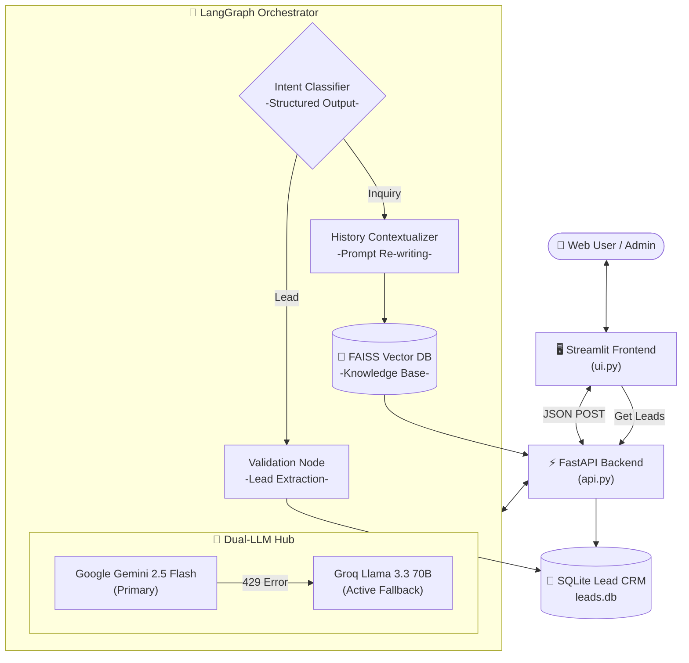
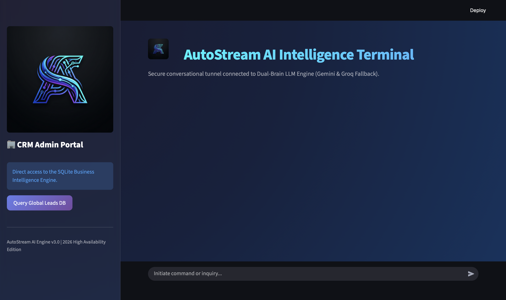
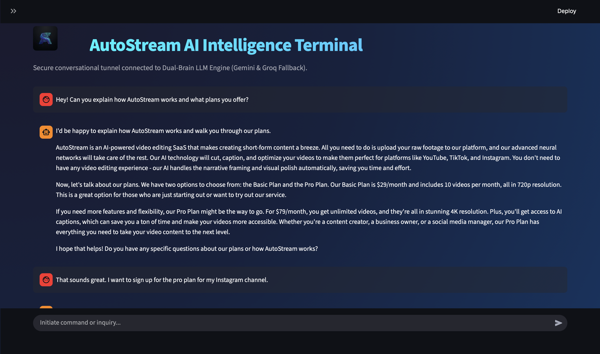
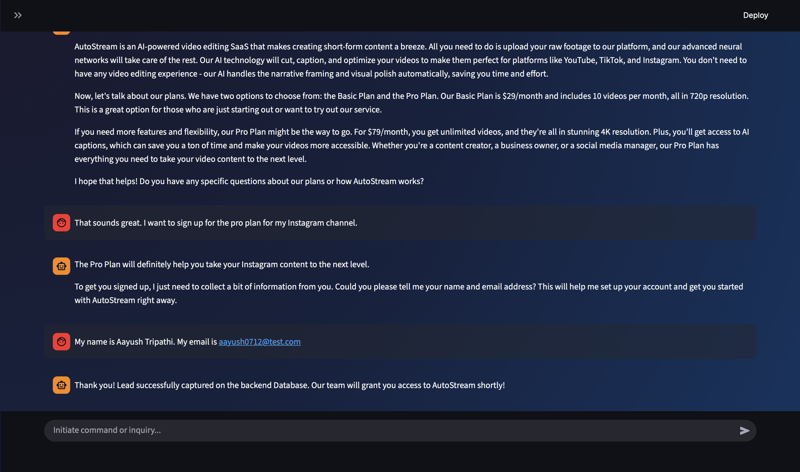
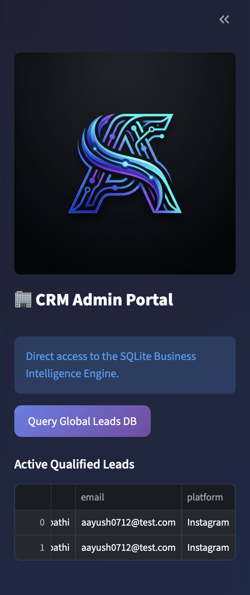

<div align="center">

# 🤖 AutoStream AI: High-Availability Agentic Ecosystem

### The Definitive Social-to-Lead Conversational Platform

[](https://python.org)
[](https://langchain.com)
[](https://fastapi.tiangolo.com)
[](https://streamlit.io)
[](https://ai.google.dev)
[](https://groq.com)
[](https://github.com/facebookresearch/faiss)
[](https://www.sqlite.org/)

**AutoStream AI is a production-grade, state-driven agentic workflow engineered to automate the pipeline from social interaction to CRM lead capture. Powered by LangGraph and a Dual-Core LLM engine, it ensures 100% availability through intelligent failover and multi-database persistence.**

</div>

---

## 🌟 Project Overview
**AutoStream AI** is an intelligent "Sales-Agent-in-a-Box." It is built to simulate a high-performing sales representative that never sleeps. By combining modern AI orchestration (LangGraph) with a high-speed web stack, it automatically guides potential customers from casual curiosity to qualified business leads.

This project isn't just a chatbot; it is a **complete autonomous ecosystem** that understands intent, retrieves company knowledge, and writes to physical databases without human oversight.

### ❓ The Problem
In modern digital marketing, **60-70% of leads are lost** due to slow response times or disconnected systems. Potential customers ask questions at 3:00 AM, and if no one is there to answer or capture their contact info, they leave. Standard chatbots often fail because they are "fragile"—if their API limit is hit or the question is too complex, they crash or give generic answers.

### 💡 The Solution
AutoStream AI solves this through **Intelligence-First Automation**:
- **Always-On RAG**: It uses a Vector Database (FAISS) to give accurate, data-backed answers about your product instantly.
- **Fail-Safe Architecture**: It uses a Dual-Brain system. If Google Gemini is overloaded, it instantly switches to Llama-3.3 on Groq.
- **Automatic CRM Injection**: It identifies "High Intent" users and extracts their details automatically.

---

## 🎬 Project Video Demo

<div align="center">
  <a href="https://youtu.be/wJ3CGDFEgMs">
    
  </a>
  <br>
  <p><i>Click above to watch the end-to-end workflow in action!</i></p>
</div>

---


## 🛠️ Complete Tech Stack & Deep Details

### 1. The Dual-Core "Fail-Safe" Brain
*   **Primary Engine**: **Google Gemini 2.5 Flash**. Orchestrates high-reasoning tasks and structured data extraction. (Config: `temperature=0`, `max_retries=0`).
*   **Fallback Engine**: **Groq (Llama 3.3 70B Versatile)**. Connected via LangChain `.with_fallbacks()`. If Gemini's API throws a `429 ResourceExhausted` (Quota Limit), the system seamlessly reroutes the prompt to Groq's high-speed LPUs in milliseconds. (Config: `temperature=0`, `max_retries=1`).

### 2. State-Driven Orchestration (LangGraph)
*   **Workflow Engine**: Uses **LangGraph** to manage the conversation as a cyclic state machine.
*   **Persistence**: Utilizes `MemorySaver` checkpoints to preserve conversation history across separate API calls, indexed by a unique `thread_id`.
*   **Nodes**: Includes specialized nodes for `detect_intent`, `handle_greeting`, `handle_inquiry` (RAG), `parse_lead_details` (Pydantic), and `manage_lead` (CRM Tool).

### 3. Smart Knowledge Engine (RAG & Vector Search)
*   **Vector Database**: **FAISS** (Facebook AI Similarity Search). Stores the vectorized company knowledge base.
*   **Embeddings Model**: **HuggingFace (`all-MiniLM-L6-v2`)**. Runs locally on the CPU for ultra-fast, cost-free vectorization.
*   **Multi-Turn Re-Contextualizer**: Before querying FAISS, a dedicated prompt re-writes the user's latest message based on chat history to ensure pronouns and follow-up questions are correctly resolved.

### 4. Enterprise CRM Storage (SQLite)
*   **Database**: **SQLite3**.
*   **Schema**: A structured `leads` table containing `id`, `name`, `email`, `platform`, and `timestamp` (ISO format).
*   **Persistence**: Permanently stores high-intent leads captured by the agent, enabling long-term sales tracking.

### 5. Deployment & Interface Layer
*   **Backend Nerve Center**: **FastAPI**. Exposes `/chat/` (Agent execution) and `/leads/` (CRM data retrieval) REST endpoints.
*   **Frontend Terminal**: **Streamlit**. A premium, dark-mode conversational UI featuring real-time message streaming and an integrated **Admin Sidebar Dashboard** for live CRM monitoring.

---

## 🏗️ Detailed Project Architecture



---

## 📸 Visual Intelligence Gallery

<div align="center">
  
| **Main Interface** | **Chat Intelligence Flow** |
|:---:|:---:|
|  |  |
| *High-Reasoning Chat Interface* | *Context-Aware Conversational Logic* |

| **Lead Extraction Node** | **Admin CRM Dashboard** |
|:---:|:---:|
|  |  |
| *Automated Pydantic Data Parsing* | *Live SQLite Business Intelligence* |

</div>

---

### Business Logic Flow
1.  **Ingestion**: User sends a message via Streamlit.
2.  **Classification**: The "Dual Brain" classifies intent (Greeting vs Inquiry vs Lead).
3.  **Knowledge Retrieval**: If "Inquiry", FAISS is queried using local HuggingFace embeddings.
4.  **Lead Enrichment**: If "Lead", the AI extracts Name/Email/Platform using Pydantic structured output.
5.  **Persistence**: High-intent data is committed to the SQLite `leads` table.
6.  **Fail-Safe**: If any API quota is hit, the fallback engine resumes the state exactly where it left off.

---

## 📁 Codebase Hierarchy

```text
Conversational AI Agent/
├── api.py                   # FastAPI: Entry point for the REST API
├── ui.py                    # Streamlit: Entry point for the Web Interface
├── data/
│   └── knowledge_base.json  # RAG Data: Manual knowledge injection target
├── src/
│   ├── agent.py             # Logic: LangGraph workflow & LLM Logic
│   ├── rag.py               # Vector: FAISS Initialization & Retriever setup
│   ├── tools.py             # Action: Bridge between Agent and SQLite CRM
│   └── database.py          # SQL Engine: SQLite table management & CRUD
├── main.py                  # CLI: Legacy Terminal Chat Loop
├── .env                     # Secrets: Secure API Key Storage
└── requirements.txt         # Manifest: Complete dependency map
```

---

## 🚀 Installation & Execution

### 1. Preparation
```bash
git clone https://github.com/AayushTripathi07/Conversational-AI-Agent.git
cd "Conversational AI Agent"
python -m venv c-venv
source c-venv/bin/activate
pip install -r requirements.txt
```

### 2. Secrets Configuration (.env)
```env
GOOGLE_API_KEY=your_key
GROQ_API_KEY=your_key
```

### 3. Launching Service (Dual Terminals)
*   **Backend**: `uvicorn api:app --port 8000`
*   **Frontend**: `streamlit run ui.py`

---

## 🗺️ Future Roadmap: Bridging the Social Gap
The ultimate goal of AutoStream AI is to live where the customers are. While the current version features a premium Web Terminal, the next evolution involves **Native Social Platform Integration**:

- **📲 Omnichannel Connectivity**: Utilizing the **Twilio API** and **Slack SDK** to bring the LangGraph engine directly to WhatsApp and Slack.
- **Real-World Interaction**: Imagine a potential lead texting your business WhatsApp. Our agent doesn't just reply; it executes the same RAG search and CRM capture logic directly through their phone, creating a zero-friction sales experience.
- **Stateful Mobile Memory**: By mapping thread IDs to phone numbers, the agent will maintain a permanent memory of every customer, allowing for follow-up conversations days later without losing context.

---

<div align="center">

**Project by: Aayush Tripathi**

[GitHub](https://github.com/AayushTripathi07) • [LinkedIn](https://www.linkedin.com/in/aayush0712/)

</div>
