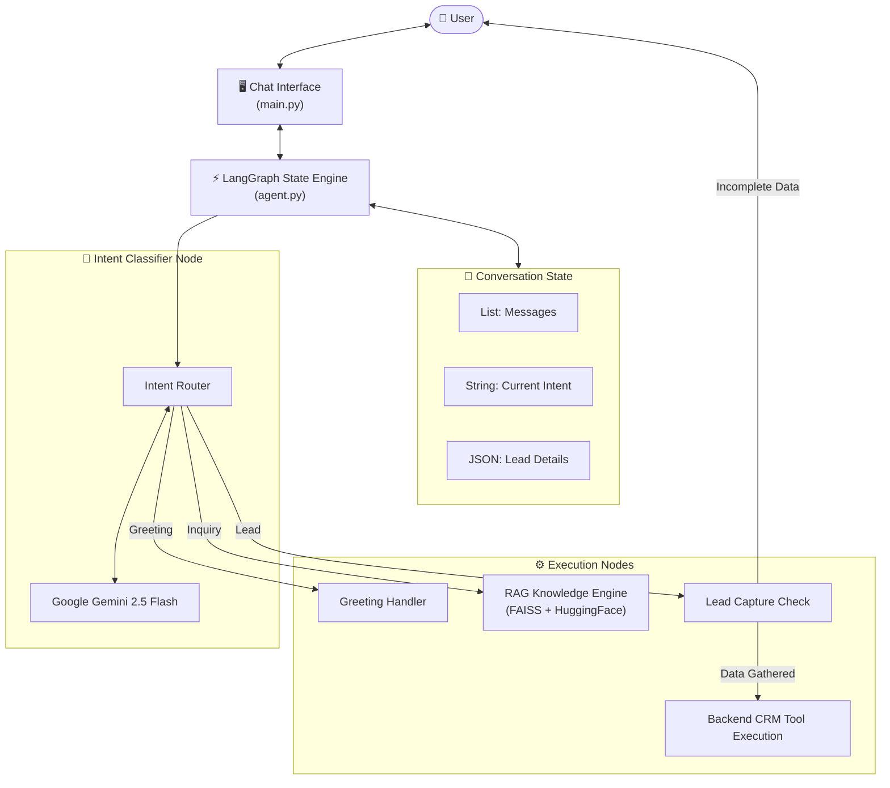

<div align="center">

# 🤖 AutoStream AI Lead Agent

### Social-to-Lead Agentic Workflow & Conversational AI Platform

[](https://python.org)
[](https://langchain.com)
[](https://ai.google.dev)
[](https://github.com/facebookresearch/faiss)

**AutoStream AI is an advanced, state-driven LangGraph conversational agent designed to seamlessly transition users from casual conversation to qualified business leads using intelligent intent-detection and local RAG retrieval.**

</div>

---

## ✨ Features

### 1. The Core AI Brain
*   **Primary Brain**: **Google Gemini 2.5 Flash**. Used for deep reasoning, intent classification, and structured data extraction.
*   **State Management**: **LangGraph** orchestrates the logic flow deterministically, ensuring that backend tool calls are meticulously coordinated and never trigger prematurely.

### 2. Multi-Node Intent Routing
The conversation dynamically branches based on the user's continuously evaluated intent:
*   **Casual Greeting**: Responds politely without activating heavy retrieval stacks.
*   **Knowledge Inquiry**: Triggers the RAG pipeline when questions about pricing and product features are detected.
*   **High-Intent Lead**: Shifts the workflow automatically to a secure data-collection state.

### 3. Smart Retrieval-Augmented Generation (RAG)
*   **HuggingFace Embeddings**: Uses `all-MiniLM-L6-v2` to vectorize the internal Knowledge Base locally.
*   **FAISS Vector Store**: Executes millisecond-latency similarity searches to perfectly answer product support queries without hallucinating.

### 4. Context-Aware Lead Capture
*   **Memory Tracking**: The AI maintains conversation history natively. If the user mentions "YouTube," it records the platform silently.
*   **Targeted Questioning**: It only asks the user for *missing* information (Name, Email) before automatically executing the Mock API Backend to capture the lead.

---

## 🏗️ Project Architecture



### Codebase Structure

```text
Conversational AI Agent/
├── data/
│   └── knowledge_base.json  # RAG target data (Pricing, Policies)
├── src/
│   ├── agent.py             # Brain: LangGraph routing & Gemini structured prompts
│   ├── rag.py               # Memory: FAISS Vector DB loading & HuggingFace Embeddings
│   └── tools.py             # CRM: Mock Lead Capture API
├── main.py                  # Terminal User Interface loop
└── requirements.txt         # Complete dependency manifest
```

---

## 🚀 Getting Started

### 1. Clone the repo
```bash
git clone https://github.com/AayushTripathi07/Conversational-AI-Agent.git
cd "Conversational AI Agent"
```

### 2. Install Dependencies
```bash
python -m venv c-venv
source c-venv/bin/activate
pip install -r requirements.txt
```

### 3. Configure API Keys (.env)
Create an `.env` file in the root directory (never commit this file):

```env
GOOGLE_API_KEY=your_gemini_api_key_here
```

### 4. Run Platform
```bash
python main.py
```

---

<div align="center">

**Author: Aayush Tripathi**

[GitHub](https://github.com/AayushTripathi07) • [LinkedIn](https://www.linkedin.com/in/aayush0712/)

</div>
